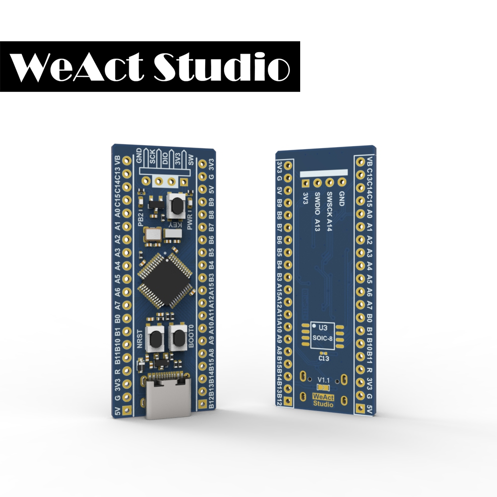

* [中文版本](./README-zh.md)
# WeActStudio.BluePill-Plus-CH32
CH32F103C8T6
> 72Mhz Max,20KB RAM,64KB ROM,Cortex-M3

CH32V103C8T6
> 72Mhz Max,20KB RAM,64KB ROM,RISC-V

CH32V103C8T6
> 144Mhz Max,20KB RAM,64KB ROM,RISC-V

CH32 Official Website www.wch.cn(zh-CN) / www.wch-ic.com(en)



## Features
* CH32F103C8T6 ARM Cortex-M3
+ `72 MHz` maximum frequency,performance at 0 wait state memory access
+ `64 Kbytes` of Flash memory, `20 Kbytes` of SRAM
* CH32V103C8T6 RISV-V
+ `72 MHz` maximum frequency,performance at 0 wait state memory access
+ `64 Kbytes` of Flash memory, `20 Kbytes` of SRAM
* CH32V203C8T6 RISV-V
+ `144 MHz` maximum frequency,performance at 0 wait state memory access
+ `64 Kbytes` of Flash memory, `20 Kbytes` of SRAM
* `8 MHz` system crystal
* `32.768 KHz` RTC crystal
* User KEY `PA0`
* Blue LED `PB2` Active high
* Red power LED `PWR`
* 2x20 side pins && 1x4 SWD pins
* Size: `52.81 mm x 20.78 mm`
* SPI Flash U3 Un place
  * PA4  CS
  * PA6  MISO
  * PA7  MOSI
  * PA5  SCK
* USB C
  * PA11  USB_DN
  * PA12  USB_DP
* SWD Debug
  * PA13  SWDIO
  * PA14  SWCLK

|Dir Name|Explain|
| :--:|:--:|
|Doc|DataSheet/ReferenceManual|
|HDK|Hardware Development Kit|
|SDK|Software Development Kit|
|Examples|Software Examples|

## How to download the program
Method 1
1. Install `WCHISPTool_Setup.exe` in `Tools` directory
Download the CH32V103 using a USB port. Download the CH32F103 using a serial port

Method 2
1. For the CH32F103, see the `Tools\CH32F103\JFlash_AddOn_For_CH32F103C8T6` directory
2. Download CH32F103 and CH32V103 using WCHLink. See wch_xxx_mcu_programtool.zip in the `Tools\CH32x103\` directory

```
/*---------------------------------------
- WeAct Studio Official Link
- taobao: weactstudio.taobao.com
- aliexpress: weactstudio.aliexpress.com
- github: github.com/WeActStudio
- gitee: gitee.com/WeAct-TC
- blog: www.weact-tc.cn
---------------------------------------*/
```